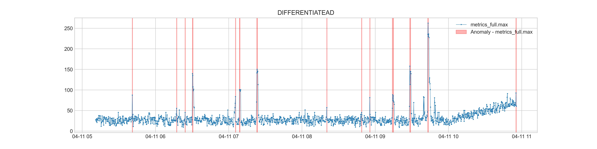
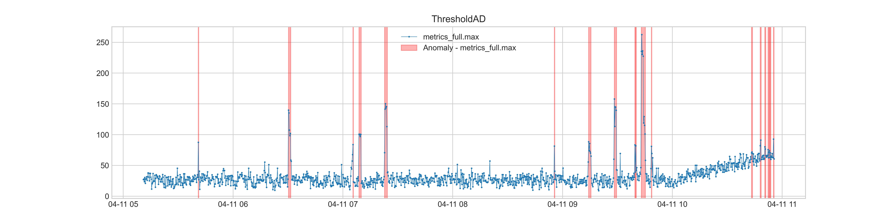
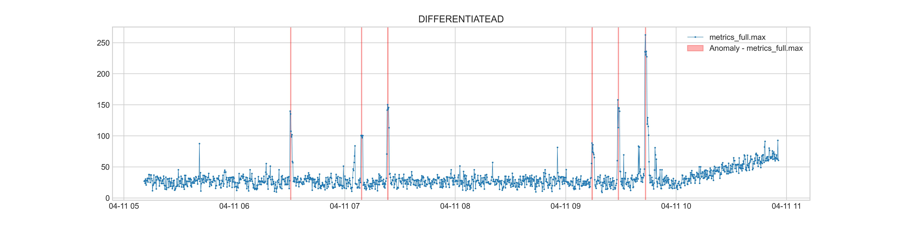
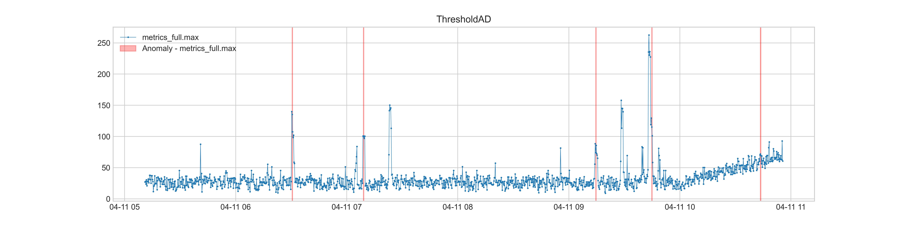

# Castor: A Python library for time series analysis

## About Castor
Castor is a Python library for time series analysis. It provides an end-to-end time series analysis framework, which can be used in Artificial Intelligence for IT Operations, Internet of Things and other scenarios. It has capabilities of efficient real-time data analysis and flexible algorithm arrangement.

Features：
* High-performance analysis: It can detect tens of thousands metrics concurrently per second in real time.
* Detector diversity: It provides a variety of anomaly detectors mainly covering scenarios such as sudden increase/decrease, continuous increase/decrease, and threshold exceeding of data.
* Streaming anomaly detection: Multiple anomaly detectors support streaming anomaly detection. To complete real-time detection for streaming data, only a small amount of data needs to be cached, and there is no need to input a large amount of historical data, which can effectively relieve the computing pressure.
* Alarm suppression: For different scenarios, TransientAnomalySuppressor, ContinuousAnomalySuppressor, LowerBoundSuppressor, VariationRatioSuppressor can be used in combination, to suppress false and duplicate alarms.
* Severity-level classification: Anomalies will be classified in terms of severity according to their various occurrence pattern. It provides guidance for developers determine the fault severity.
* Flexible algorithm combination. The detection process can be flexibly configured through configuration parameters. In detection process, anomaly detectors, alarm suppressors and severity-level classifiers can be freely chosen and configured according to requirements through configuration parameters.
## Installation
Python version requirement: 3.9.1

Install from source code:
```shell
> git clone https://github.com/openGemini/openGemini-castor.git
> cd openGemini-castor
> python3 setup.py install
```

## Quick start
In order to help developers use Castor quickly, this chapter provides an example of using DFFIENTIATEAD and ThresholdAD algorithms to detect anomalies.

#### Prepare data and parameters for detection
At first, we need to prepare data and configuration parameters for detection. The parameters can be obtained by loading the default configuration file.
```python
from castor.utils.base_functions import load_params_from_yaml
import pandas as pd
data = pd.read_csv("./tests/data/fluctuate.csv", index_col="time", parse_dates=True)
params = load_params_from_yaml(config_file="./conf/detect_base.yaml")
```

#### Detect anomalies in time series

After DIFFERENTIATEAD and ThresholdAD are specified, initialize the model and detect the data.

```python
from castor.detector.pipeline_detector import PipelineDetector
from adtk.visualization import plot
from castor.utils import const as con
algo_list = ["DIFFERENTIATEAD", "ThresholdAD"]
pipeline_detector = PipelineDetector(algo_list, params)
results = pipeline_detector.run(data)
for algo, anomalies in zip(algo_list, results):
    labels = anomalies.get(con.LABEL)
    ax = plot(data, anomaly=labels, anomaly_color="red")
    ax[0].set_title(algo)
```

If the alarm suppressor is canceled in the configuration parameters (like configuration in detect_base_with_suppressor.ymal file), the result will contain all anomalies detected by the anomaly detectors:




If the default configuration file is used completely, Castor will perform alarm suppression according to the alarm suppressor specified by the configuration parameters, that is, some anomalies will be removed from the results, to reduce false or duplicate alarms:




## Contribution
[Tips for Contribution](https://github.com/openGemini/openGemini/blob/main/CONTRIBUTION.md)


## License
Castor is licensed under the Apache License 2.0. Refer to [LICENSE](https://github.com/openGemini/openGemini-castor/blob/main/LICENSE) for more details.


